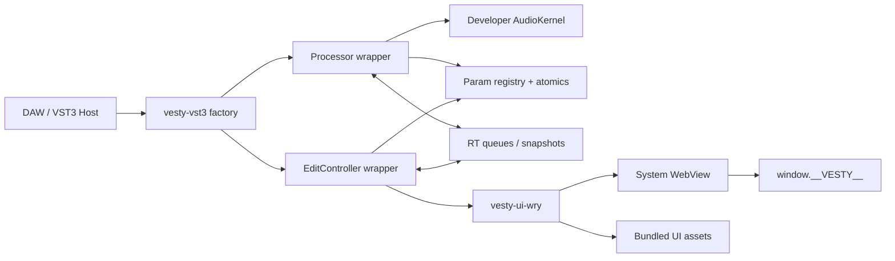

# 02. 总体架构

## 架构原则

Vesty 的架构围绕三个隔离面设计:

- 实时音频面: 只处理预分配数据、原子参数和无阻塞队列。
- 控制面: 处理 VST3 controller、参数元数据、state、UI bridge 和 host 通知。
- UI 面: wry WebView、JS bridge、assets protocol、dev server。

这三个面之间只通过明确的、可丢弃或可背压的消息通道通信。Web UI 永远不能直接访问音频 kernel。

## 进程与线程

VST3 插件通常加载在 DAW 进程内:

- DAW/host 主线程或 UI 线程创建 controller/editor。
- DAW audio thread 调用 processor 的 process。
- Vesty 可创建控制辅助线程和日志线程，但不得创建任何需要音频线程等待的线程依赖。
- wry WebView 必须由 UI 线程持有，因为 `WebView` 是 `!Send`/`!Sync`。

## 逻辑图

## 数据流

### Host 自动化到 DSP

1. Host 在 VST3 process data 中传入参数变化 queue。
2. `vesty-vst3` 将 normalized value 转成 Vesty 参数事件。
3. `ParamRegistry` 更新原子镜像和 block 内 sample-accurate event list。
4. `AudioKernel::process` 读取当前参数、smooth 参数或逐 sample 处理自动化点。

### Web UI 到 Host/Processor

1. JS 调用 `window.__VESTY__.setParam(id, value)`。
2. wry IPC handler 收到 JSON envelope。
3. `vesty-ui` 投递给 controller/control runtime。
4. controller 调用 host 的 beginEdit/performEdit/endEdit 语义。
5. host 再把参数变化送到 processor，形成单一权威路径。

注意: UI 不直接写 processor 参数，只能走 host 可见参数路径，避免自动化和 state 不一致。

### DSP 到 Web UI

1. audio thread 生成 meter/analyzer 简短帧。
2. 写入 SPSC ring buffer 或 triple buffer；满则丢弃。
3. control/UI thread 按 30/60 Hz drain 或 read latest。
4. UI thread 用 `evaluate_script` 或 IPC response 发送给 JS。

## 生命周期

### 插件实例

1. Host load bundle。
2. 调用 module entry。
3. 调用 `GetPluginFactory`。
4. 创建 processor 和 controller。
5. 初始化 processor/controller。
6. 设置 bus arrangement、sample rate、max block size。
7. 调用 `setProcessing(true)` 后进入 process loop。
8. 保存/恢复 state 时调用 getState/setState。
9. 卸载时 detach editor、terminate、module exit。

### UI editor

1. Host 创建 editor view。
2. `IPlugView::attached(parent, platform_type)` 收到 native parent。
3. Vesty 把 parent 包成 raw-window-handle/平台 wrapper。
4. UI thread 创建 child WebView。
5. 加载 dev URL 或 `vesty://assets/index.html`。
6. 注入 `window.__VESTY__` bridge。
7. `IPlugView::onSize`/host resize 更新 WebView bounds。
8. `IPlugView::removed` 销毁 WebView，保留参数和 processor。

## 错误边界

- VST3 ABI 边界: `catch_unwind`，转换为 VST3 结果码或 faulted silence。
- WebView 边界: UI crash/reload，不影响 processor。
- IPC 边界: schema validation，未知消息返回错误，不 panic。
- Asset 边界: 只读取 manifest 内资源，禁止路径穿越。
- Audio kernel 边界: developer code panic 后实例 faulted，后续 process 输出静音。

## 为什么不用 Tauri

Tauri 是桌面应用框架，解决菜单、窗口、权限、打包、更新、命令系统等问题。VST3 插件的窗口由 DAW 拥有，生命周期由 VST3 editor view 驱动，且音频线程实时性要求比普通桌面应用严格。Vesty 只需要 wry 的系统 WebView 能力，并自己实现更小、更可控的 IPC、资源协议和线程模型。

