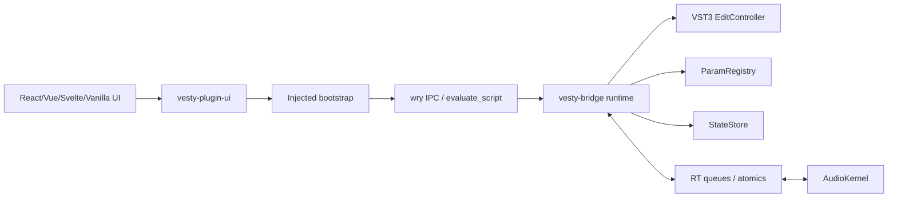

# 12. JSBridge、状态共享与事件通信设计

设计日期: 2026-06-07

## 目标

Vesty 的 Web UI 必须能稳定地和 Rust/VST3 底层通信，同时不能破坏音频实时性。JSBridge 的目标是:

- 给前端提供 framework-agnostic API。
- 支持参数读写、自动化手势、插件状态、meter/analyzer、transport、日志和错误事件。
- 与 React/Vue/Svelte 等框架解耦。
- 所有协议都有版本号、类型定义、schema 校验和错误语义。
- Web UI reload 后能重新握手并恢复状态。
- 音频线程不直接参与 WebView、JSON、JS 或 promise。

非目标:

- 不做 Tauri command 系统。
- 不提供任意 Rust 函数给 JS 调用。
- 不把 audio sample buffer 直接共享给 JS。
- 不用 JS 参与 sample/block 级实时处理。

## wry 事实约束

基于 wry `0.55.1`:

- `with_initialization_script` 可以在页面 load 时注入 JS，并保证早于 `window.onload`。
- `with_ipc_handler` 接收 JS 侧 `window.ipc.postMessage("...")`，Rust handler 类型是 `Fn(Request<String>)`。
- wry IPC 没有同步返回值。Rust 必须通过 `WebView::evaluate_script` 或 `evaluate_script_with_callback` 回推 response/event。
- `with_custom_protocol` 可注册自定义资源协议，但不同平台 custom protocol origin 不一致。
- `build_as_child` 可把 WebView 嵌入 host parent；Linux child path 只支持 X11，Wayland 需要 GTK 路线。
- `WebView` 由 UI 线程拥有，不能跨线程直接操作。

设计推论:

- JSBridge 必须是异步协议，不能设计成同步 RPC。
- 每个 request 都需要 `id`，Rust response 通过 JS dispatcher 投递。
- Rust 到 JS 的所有消息必须在 UI thread 执行 `evaluate_script`。
- `window.__VESTY__` 必须由初始化脚本提前注入，页面代码只消费稳定 API。

## 分层架构



### Rust crates

建议新增或细分:

- `vesty-ipc`: protocol structs、serde、ts-rs/schemars、错误码。
- `vesty-bridge`: bridge runtime、router、state store、subscription manager、backpressure。
- `vesty-ui-wry`: wry transport adapter。
- `vesty-ui`: host-neutral UI trait。

### JS packages

已落地/建议发布:

- `vesty-plugin-ui`: framework-agnostic bridge core。
- `vesty-plugin-ui/react`: hooks 和 store adapter。
- `vesty-plugin-ui/vue`: composables。
- `vesty-plugin-ui/svelte`: stores。

`vesty-plugin-ui` 是底层稳定 API；`vesty-plugin-ui/react`、`vesty-plugin-ui/vue`、`vesty-plugin-ui/svelte` 是薄适配，只包装 bridge、snapshot store 和参数编辑 helper，不引入 Tauri command 风格 API。Rust IPC 生成的协议类型会随 `vesty-plugin-ui` 发布，并通过 `vesty-plugin-ui/protocol` 子路径暴露给 UI 项目使用。

## Wire Protocol

所有消息都是 JSON envelope。JS -> Rust 会先构造完整 packet、`JSON.stringify()` 成 `message`，按 lane 做 UTF-8 byte length 上限检查后再调用 `window.ipc.postMessage(message)`；Rust -> JS 使用 `evaluate_script` 调用内部 dispatcher。普通 command/param/event/meter/log/lifecycle request 上限为 64 KiB，state request 上限为 256 KiB。

### Packet

```ts
type BridgeLane =
  | "lifecycle"
  | "command"
  | "param"
  | "state"
  | "event"
  | "meter"
  | "log";

type JsonValue =
  | number
  | string
  | boolean
  | JsonValue[]
  | { [key: string]: JsonValue }
  | null;

interface BridgePacket<T = JsonValue> {
  v: 1;
  session: string;
  seq: number;
  lane: BridgeLane;
  kind: "request" | "response" | "event" | "ack" | "error";
  type: string;
  id?: string;
  replyTo?: string;
  payload?: T;
  error?: BridgeErrorPayload;
  flags?: string[];
}
```

### Error

```ts
interface BridgeErrorPayload {
  code:
    | "parse_error"
    | "unsupported_version"
    | "unsupported_type"
    | "validation_error"
    | "permission_denied"
    | "timeout"
    | "backpressure"
    | "host_rejected"
    | "plugin_faulted"
    | "state_conflict"
    | "internal_error";
  message: string;
  details?: JsonValue;
  retryable?: boolean;
}
```

### Rust -> JS delivery

Rust 不拼接不可信字符串。只把序列化后的 JSON 作为 JS object literal 传入:

```rust
let packet_json = serde_json::to_string(&packet)?;
let script = format!("window.__VESTY_INTERNAL__.deliver({packet_json});");
webview.evaluate_script(&script)?;
```

批量事件:

```rust
let batch_json = serde_json::to_string(&packets)?;
let script = format!("window.__VESTY_INTERNAL__.deliverBatch({batch_json});");
webview.evaluate_script(&script)?;
```

JS delivery 入口是 fail-closed。`vesty-plugin-ui` 和 wry bootstrap 都会在分发前校验 `deliver(packet)` / `deliverBatch(packets)` 的运行时 shape: batch 必须是数组，packet 必须是 plain data object、`v = 1`、session/type 字符串非空且长度/控制字符合法、`seq` 是 JavaScript safe integer 范围内的非负整数、lane/kind 是已知枚举，`flags` 如果存在必须是最多 16 个非空、最长 64 UTF-8 bytes、无控制字符的字符串，Rust -> JS packet 不能携带 `id`。response/error 必须有合法 `replyTo`；response 不能携带 `error`；error packet 不能携带 `payload`，且必须有协议枚举内的合法 `code`、最长 2048 UTF-8 bytes 且无控制字符的 string `message` 和 boolean `retryable`；`error.details` 与所有 inbound `payload` 都必须是 JSON-compatible value，并受递归边界约束: max depth 64、array items 65536、object keys 16384、nodes 262144、string bytes 262144。event/ack 不能携带 `replyTo` 或 `error`。不合法的入站 packet 会被丢弃，不会触发 listener，不会错误 settle pending Promise，也不会从全局 dispatcher 抛异常；合法 packet 仍然继续做当前 editor session 匹配。`ack` 目前作为保留 kind 接收后静默忽略，不派发给 subscription listener。

JSON-compatible value 指 `null`、boolean、finite number、string、array 或 plain/null-prototype object；运行时会拒绝 `undefined`、function、symbol、`NaN`、`Infinity`、循环引用、非 plain object、symbol key、accessor/getter 属性和非 enumerable 属性。JS -> Rust request payload 也使用同一校验，避免 `JSON.stringify` 静默丢字段或把非有限 number 改写成 `null`。可选字段必须在不存在时省略，例如 param gesture 没有 `gestureId` 时不发送 `gestureId: undefined`。Rust `BridgeRuntime` 在 request dispatch 前也会对 parsed `serde_json::Value` payload 执行同一 JSON 边界校验，因此绕过 SDK 直接调用 native IPC 的页面仍不能把超深/超大 payload 送入业务 handler。

Rust outbound 也在协议 crate 收口。`BridgeErrorPayload::new()` 会保留合法 message、把控制字符替换为空格，并按 UTF-8 char boundary 截断到 2048 bytes；`BridgeErrorPayload::set_details()` / `with_details()` 会验证 details 的 JSON 边界；`BridgePacket::error_to()` 会在最终出站前再次净化 details；`BridgePacket::response_to()` 会净化 response payload。bridge runtime 的 reliable event、latest meter 和 RT log payload 在发送前也会净化。非法 details/payload 会降级为 `{ "dropped": true, "reason": "..." }`，因此 bridge runtime、VST3 adapter 和 wry panic fallback 通过标准构造器/出站 helper 生成的 envelope 默认满足 WebView 入站规则。outbound reliable event、latest meter 和 RT log topic 也会复用 packet `type` 校验；无效 topic fail-closed 不发送、不排队，flush 时再次跳过内部误插入的无效 meter topic，避免 Rust 出站生成 JS inbound validator 会拒绝的 packet。

wry bootstrap 暴露给页面的 `window.__VESTY_INTERNAL__` 也按 fail-closed 原则收紧。`setSession(value)` 使用和 ready payload 相同的 session 约束: 非空 string、最长 128 UTF-8 bytes、无控制字符；`request(type, lane, payload)` 会同时校验 request type 与 lane，lane 必须是已知 `BridgeLane` 枚举值。直接绕过 `window.__VESTY__` 使用 internal fallback 的页面不能写入畸形 session，也不能构造未知 lane 的 pending request。

## 握手流程

1. `with_initialization_script` 注入 `window.__VESTY_INTERNAL__` 和 `window.__VESTY__`。
2. 页面 JS 加载后调用 `window.__VESTY__.ready()`。
3. JS 发送 `bridge.hello` request，包含 JS package version、supported protocol versions、页面 URL。
4. Rust 校验 session、origin、版本和 capabilities；当前实现要求 `supportedProtocolVersions` 包含 `1`，并限制 JS package version 和 page URL 的长度。
5. Rust 返回 `bridge.ready`，包含 plugin metadata、param schema、state schema、capabilities、initial snapshot。
6. JS ack `bridge.readyAck`。
7. Rust 开始发送订阅事件。

当前实现中，`vesty-plugin-ui` 与 wry bootstrap 都会在 `bridge.hello` response 后校验并采纳 `editorSessionId`，再用该 editor session 发送 `bridge.readyAck`。`editorSessionId` 必须是非空、最长 128 UTF-8 bytes 且不含控制字符的字符串；畸形 ready session 会以 non-retryable `validation_error` 拒绝，不采纳 session，也不发送 readyAck。Rust `BridgeRuntime` 要求 readyAck 必须发生在一次成功的 `bridge.hello` 之后；提前发送会返回 non-retryable `permission_denied`，并且不会把 editor 标记为 ready。顺序通过后，runtime 还会校验 ack payload 的 `protocolVersion` 必须存在、是非负整数且等于当前协议版本；缺失或类型错误返回 non-retryable `validation_error`，不支持版本返回 `unsupported_version`。全部校验通过后才记录 editor ready 状态，并返回 `bridge.readyAck.response`。

JS 侧也会校验 `bridge.hello` response 的 `protocolVersion`，当前只接受 `1`。如果 host/editor 返回缺失或不支持的协议版本，`ready()` 会以 `unsupported_version` 拒绝，不采纳新的 `editorSessionId`，也不会发送 `bridge.readyAck`。这样版本协商失败不会进入半 ready 状态。

`ready()` 在同一个 bridge instance 内是幂等的：并发调用共享同一条 `bridge.hello` / `bridge.readyAck` promise；成功后后续调用直接返回缓存的 ready payload；失败时会清空 ready promise，允许 UI reload 或 transient IPC 错误后重试。

协议产物:

- `vesty export-types --out target/vesty-protocol` 会调用 `vesty-ipc::export_protocol_bindings()`。
- TypeScript 产物位于 `typescript/protocol/*.ts`，包含 `BridgePacket`、`BridgeReadyPayload`、`BridgeHelloPayload`、`BridgeCapabilities`、`BridgeDiagnosticsSnapshot`、`PluginFaultReport`、`RtLogRecord`、`PluginSnapshot`、`ParamSpec`、`ParamKind`、`ParamMidiMapping` 等。
- JSON Schema 产物位于 `json-schema/*.schema.json`，覆盖 `BridgePacket`、`BridgeReadyPayload`、`BridgeHelloPayload`、`BridgeDiagnosticsSnapshot`、`RtLogRecord`、`ParamChangedEvent`、`ParamSpec`。
- 生成配置把 `u64`/revision/seq 映射为 JS `number`，与当前 JSON packet 和 `vesty-plugin-ui` API 保持一致。对于 Bridge envelope 的 `seq`，Rust 和 JS 运行时会共同限制到 `0..=Number.MAX_SAFE_INTEGER` / `9_007_199_254_740_991`，避免 JSON 数字在 Web 端失去精度；其它 revision/sequence 字段仍按各自 payload 语义处理。
- 参数 schema 的 wire shape 使用 JS 侧一致的 camelCase: `ParamSpec.defaultNormalized`、`ParamSpec.stepCount`、`ParamSpec.midiMappings`、`ParamFlags.readOnly`、`ParamFlags.programChange`，`ParamKind` 使用 `"float"` / `"bool"` / `"choice"` tag。Rust 侧仍保留读取旧 `default_normalized` / `step_count` / `midi_mappings` / `read_only` / `program_change` 和 `Float` / `Bool` / `Choice` 的兼容反序列化。
- `BridgeRuntime::new()` / `BridgeRuntime::try_new()` 在建立 ready store 和参数 ID 映射前会调用 `vesty-params::validate_param_specs()` 并返回 `ParamSpecError`，拒绝空 ID、重复 ID、control character、非法 default/range/choice label 以及 `readOnly && automatable` 等非法 schema。VST3 controller 创建也使用同一校验器，因此无效参数 schema 会在 host/controller 和 JSBridge runtime 两个边界都被挡住。
- `vesty-plugin-ui` 的 `ready()` 和 `vesty-ui-wry` 注入 bootstrap 的 fallback `ready()` 都会对 `bridge.hello.response` 做运行时 shape 校验: protocol version、`editorSessionId` session shape、metadata、capabilities、snapshot revisions 和 `params` schema 必须有效，重复参数 ID 或非法 flags/kind/default/midiMappings 会以 non-retryable `validation_error` 拒绝，并清空 ready promise 允许后续重试。JS 侧校验不是权威源，但能保护开发模式、测试 harness 或旧 bootstrap 返回畸形 payload 时的 UI 行为。
- `BridgeHelloPayload`、`BridgeReadyPayload` 和 `BridgePacket` 顶层按公共协议处理，保留 forward-compatible 扩展语义。Rust/JS 会校验 `bridge.hello` 必需字段、支持的 protocol version 和 hello metadata 长度，但不会因为 hello payload 出现未来 JS capability 字段而拒绝握手；JS SDK 会校验 ready 必需字段和已知 nested shape，但不会因为 ready payload 顶层、capabilities、snapshot、param flags/kind 或 MIDI mapping 中出现额外字段而拒绝握手；成功后的 cached ready payload 会原样保留这些扩展字段，供未来 host/vendor capability 做渐进增强。与此相对，Vesty 内建 request payload 和 bundle/release evidence manifest 属于固定内部 schema，可使用 allowlist 或 `deny_unknown_fields` 收紧。
- `BridgeRuntime` 是 state/param/query/flush command payload 的权威校验源: `snapshot.get`、`diagnostics.get`、`meter.flush` 和 `event.flush` 只接受无 payload、`null` payload 或空 object；`payload: null` 在当前公共 envelope 的 `Option<Value>` serde 形态下等价于省略 payload。字符串、数组、布尔、数字或非空 object 会返回 validation error。`bridge.readyAck` 只接受 `protocolVersion`；`subscription.add/remove` 只接受 `topic`；`state.setConfig` / `state.setUiState` 会区分 missing field 和 wrong type，要求 `baseRevision` 是非负整数，要求 config key 是合法 string，并要求 JSON value 字段存在；`value: null` 是合法写入，表示清空 config entry 或 persistent UI state。`param.begin` / `param.perform` / `param.end` / `param.format` / `param.parse` 会校验 param id string 非空且无控制字符、normalized 是 finite number、parse text 是 string、optional `gestureId` 是合法 string。`vesty-plugin-ui` 和 wry bootstrap 的预校验只负责减少无效 IPC，不能替代 native bridge 的最终判断。
- `BridgeReadyPayload.capabilities` 不是纯展示字段。Rust `BridgeRuntime` 会在 dispatch 前强制执行 capability gate: 关闭 `paramGestures` 会拒绝 `param.begin/perform/end`，关闭 `paramFormatParse` 会拒绝 `param.format/parse`，关闭 `stateConfig` 会拒绝 `state.setConfig/state.setUiState`，关闭 `subscriptions` 会拒绝 `subscription.add/remove`，关闭 `meterStream` 会拒绝 `meter.flush` 和 `meter.*` topic/queue，关闭 `diagnostics` 会拒绝 `diagnostics.get`、`diagnostics.fault`/`log.rt` topic 和 RT log emission，关闭 `reliableEvents` 会拒绝除 meter/diagnostics/log 之外的 subscribable reliable topics。被 capability gate 拒绝的 request 返回 non-retryable `unsupported_type`，且不会污染 subscription table、state snapshot 或 pending param gesture queue。
- `ParamFlags.readOnly` 是写入权限约束: `param.begin` / `param.perform` / `param.end` 对 read-only 参数返回 `permission_denied`，但 `param.format` / `param.parse` 仍允许用于 meter/analyzer 等只读参数显示。
- `ParamFlags.programChange` 是 host/plugin metadata: VST3 adapter 会把它映射到 `kIsProgramChange`，并可在 controller/control-thread 上把 `setParamNormalized()` / edit relay 的 plain value 解释为可见 program index。JSBridge 只负责在 ready payload/schema 中传递与校验该 flag，不在 bridge runtime 内把它解释成 program load；UI 发出的 `param.perform` 仍通过 VST3 controller 入口获得最终确认。
- `packages/plugin-ui/src/protocol` 和 `src/serde_json` 保存从 Rust IPC 生成的 TypeScript snapshot；package build 会把它们输出到 `dist/protocol` 和 `dist/serde_json`。顶层 `vesty-plugin-ui` 会 re-export 常用协议类型，精确协议类型可从 `vesty-plugin-ui/protocol` 引入。

### Ready payload

```ts
interface BridgeReadyPayload {
  protocolVersion: 1;
  instanceId: string;
  editorSessionId: string;
  devMode: boolean;
  pluginName: string;
  vendor: string;
  capabilities: BridgeCapabilities;
  params: ParamSchema[];
  snapshot: PluginSnapshot;
}

interface BridgeCapabilities {
  paramGestures: boolean;
  paramFormatParse: boolean;
  stateConfig: boolean;
  subscriptions: boolean;
  meterStream: boolean;
  reliableEvents: boolean;
  diagnostics: boolean;
}
```

### Diagnostics

UI 可通过 `diagnostics.get` 读取控制线程诊断快照，也可以订阅 `diagnostics.fault` 接收 fault report 事件，订阅 `log.rt` 接收 best-effort 实时日志记录。诊断快照包含:

- `readyAcknowledged`: UI 是否完成 `bridge.readyAck`。
- `subscriptionCount` / `subscriptions`: 当前 bridge 订阅状态。
- `pendingParamGestures`: 尚未被 host adapter drain 的参数手势数量。
- `droppedParamGestures`: 为优先接收 `param.end` 而丢弃的旧 pending gesture 累计数，用于观察 bridge 背压下的手势收尾保护。
- `pendingMeterTopics`: latest-wins meter 队列中待 flush topic 数。
- `fault`: VST3 processor panic guard 暴露的 `faulted` 和 `faultCount`，如果 controller 尚未绑定 telemetry channel 则为空。

`diagnostics.get`、`diagnostics.fault` 和 `log.rt` 都只在 UI/control 线程序列化 JSON。audio thread 只更新原子 `FaultState` 或向 SPSC 写入固定 `RtLogEvent`，不做字符串格式化、WebView 调用或 JSON。

`log.rt` payload 是 `RtLogRecord`，只包含 `sequence`、`level`、`kind`、`queue`、`dropped`、`code`、`value/valueA/valueB` 等枚举和数字字段。队列满时 audio thread 可以直接丢弃，UI 未订阅时 controller drain 后也会丢弃，符合 best-effort 诊断语义。

订阅 `meter.*`、`param.changed`、`diagnostics.fault` 或 `log.rt` 后，wry bootstrap 和 `vesty-plugin-ui` 会启动约 60 Hz 的 async event pump，周期性发送轻量 `event.flush` request。每个 bridge instance 同时最多保留一个 in-flight `event.flush`；若上一轮仍未 resolve/reject，下一次 interval tick 会跳过，避免 host/UI 卡顿时堆积 pending request 和 timeout。即使开发者把普通 request timeout 配置为 `0`，内部 `event.flush` 也会使用固定 1000ms watchdog；超时只丢弃这一次 flush 的 pending request 并释放 in-flight 标记，下一次 interval tick 可以继续拉取 latest-wins meter/log/fault/param event。该 request 不把任何工作放进 audio thread；它只让 UI/control 线程有机会 drain controller pending queue、RT SPSC telemetry、fault/log snapshot，并通过同一批 `BridgePacket` 回推给 WebView。

## 权威状态模型

状态不能“共享可变内存”。Vesty 使用 snapshot + revision + event patch。

### 状态分类

| 状态 | 权威源 | UI 可写 | 进入音频线程方式 |
| --- | --- | --- | --- |
| automatable parameters | Host/VST3 controller | 可以，但必须走 begin/perform/end | Host process data -> atomic/automation events |
| plugin config | Controller/control state | 可以，经过 schema 校验 | control snapshot -> safe point |
| persistent UI state | Controller state | 可以 | 不进 audio，除非显式映射 |
| meter/analyzer | AudioKernel summary | 不可以 | audio -> RT queue -> UI latest frame |
| transport | Host | 不可以 | process context/control mirror |
| logs/errors | Rust runtime | 不可以 | event only |

核心规则:

- 参数以 host 为权威源，UI 不直接写 audio atomic。
- plugin config 以 controller state 为权威源，UI 只能提交 command/patch。
- audio 产生的 meter 是只读、可丢弃、latest-wins。
- UI local-only 状态默认不保存；需要保存时进入 `ui_state` namespace。

## StateStore

Rust 侧维护:

```rust
struct BridgeStateStore {
    revision: u64,
    params_revision: u64,
    config_revision: u64,
    ui_revision: u64,
    snapshot: Arc<PluginSnapshot>,
}
```

更新原则:

- 每次成功提交生成新 revision。
- 发给 UI 的 event 带 `revision`。
- UI 提交 patch 必须带 `baseRevision`。
- base revision 过旧时返回 `state_conflict`，并附最新 snapshot 或 patch。
- VST3 controller state 会把 bridge snapshot 序列化到独立 `bridge` 字段，和开发者 `custom` state 分开；重新加载 state 后，新的 editor handshake 会从该 snapshot 恢复 config/UI state。旧 state 缺少 `bridge` 字段时按默认 snapshot 处理。若 Web UI 已经打开，controller `setState()` / `setComponentState()` 会更新带 generation 的共享 bridge snapshot，active wry bridge runtime 在下一次 IPC / `event.flush` 前吸收该 snapshot，并向订阅了 `state.changed` 的 UI 推送完整 `PluginSnapshot`。

### State patch

MVP 使用 typed commands，而不是开放式任意 patch:

```ts
interface SetConfigRequest {
  baseRevision: number;
  key: string;
  value: unknown;
}

interface SetUiStateRequest {
  baseRevision: number; // current uiRevision
  value: unknown;       // replaces PluginSnapshot.uiState
}
```

后续可引入 JSON Merge Patch 或 JSON Patch，但必须经过 schema 和权限检查。

## 参数通信

参数是插件 UI 的最高频控制路径，需要单独设计。

### JS API

```ts
interface VestyBridge {
  ready(): Promise<BridgeReadyPayload>;
  getSnapshot(): Promise<PluginSnapshot>;
  setConfig(key: string, value: unknown, baseRevision: number): Promise<PluginSnapshot>;
  setUiState(value: unknown, baseRevision: number): Promise<PluginSnapshot>;

  beginParamEdit(id: string, gestureId?: string): Promise<void>;
  performParamEdit(id: string, normalized: number, gestureId?: string): Promise<void>;
  endParamEdit(id: string, gestureId?: string): Promise<void>;

  setParam(id: string, normalized: number, gestureId?: string): Promise<void>;
  formatParam(id: string, normalized: number): Promise<string>;
  parseParam(id: string, text: string): Promise<number>;

  subscribe<T>(topic: string, handler: (event: T) => void): () => void;
  request<T>(type: string, payload?: unknown): Promise<T>;
}

interface CreateBridgeOptions {
  timeoutMs?: number; // default 5000; <= 0 disables ordinary JS-side request timeout; internal event.flush still has a watchdog
}
```

`vesty-plugin-ui` 会在 `createBridge(host, initialSession, options)` 初始化时做 runtime validation: host 必须是 object 且提供 `addEventListener`，`initialSession` 必须是非空、长度受限且不含控制字符的 string，`options` 必须是 object，`timeoutMs` 必须是 finite number。无效输入会以 non-retryable `validation_error` 抛出，并且不会注册 unload listener、创建 `__VESTY_INTERNAL__` 或发送 IPC。初始化仍不要求 `host.ipc` 必须存在；缺失 IPC 会在具体 request 时 reject，方便普通浏览器/dev harness 做无 native 预览。

所有 JS -> Rust request 的 `type` 也会在 `vesty-plugin-ui` 和 wry bootstrap 的内部发送入口校验: 必须是 string、非空、最长 128 UTF-8 bytes、不能包含控制字符。无效 `request(type, payload)` 会以 non-retryable `validation_error` 在本地拒绝，不会创建 pending request、启动 timer 或调用 `window.ipc.postMessage`。

Rust `BridgeRuntime` 也会在 native IPC 边界做同一 packet type 权威校验。直接伪造 `window.ipc.postMessage(...)` 的空 type、超过 128 UTF-8 bytes 的 type 或带控制字符的 type 会收到 non-retryable `validation_error`，错误回包的 `type` 固定为 `bridge.invalidType.error`，避免把畸形 type 原样拼回 UI。若 JSON object 可识别为当前 editor session 的 request 且包含 string `id`，但无法反序列化成完整 `BridgePacket`，runtime 会返回 non-retryable `parse_error`，错误回包 `type` 为 `bridge.parseError.error`；session 不匹配、非 request 或无合法 id 的畸形消息不回包。

### Gesture

拖拽 slider:

```text
pointerdown         -> param.begin
pointermove/input   -> param.perform, throttled
pointerup/cancel    -> param.end
lostpointercapture  -> param.end fallback
```

UI 应在 pointerdown 时尽量调用 `setPointerCapture(pointerId)`，并用本地 `editing` guard 防止 `pointerup` 与 `lostpointercapture` 双重触发 `param.end`。这不是实时路径要求，但可以避免 WebView/host 窗口切换、拖拽离开控件或 pointer cancel 时让 VST3 host 的 beginEdit/endEdit 悬挂。

按钮/toggle:

```text
click -> param.begin + param.perform + param.end
```

### Echo suppression

每个 UI gesture 可以带同一个 optional `gestureId`，从 begin 贯穿到 perform/end:

```ts
interface ParamGesturePayload {
  id: string;
  gestureId?: string;
}

interface ParamPerformPayload extends ParamGesturePayload {
  normalized: number;
}
```

Rust 广播 host 确认后的 `param.changed`:

```ts
interface ParamChangedEvent {
  id: string;
  normalized: number;
  plain?: number;
  display?: string;
  source: "host" | "ui" | "state" | "program";
  gestureId?: string;
  revision: number;
}
```

UI 收到同一 `gestureId` 的事件时只同步 confirmed value，不重复触发 setter。

`setParam(id, normalized, gestureId?)` 是按钮/toggle 和一次性参数写入的便捷 API；如果传入 `gestureId`，SDK 与 wry bootstrap 会把同一个 token 依次放进 `param.begin`、`param.perform` 和 `param.end` payload。

### 高频策略

- UI -> Rust `param.perform` 默认节流到 120 Hz。
- Rust -> UI `param.changed` 在 wry bridge handler 的 response/event batch 中回推；UI 发起的 `param.perform` 被 host 接受后即时返回 `source: "ui"` confirmed event。
- Host/controller 直接调用 `setParamNormalized()`、state restore 或 controller-side program apply/program data load 时，controller 侧 latest-wins 保留每个参数最后一次变化；UI 订阅 `param.changed` 后通过 `event.flush` drain，并分别收到 `source: "host"`、`source: "state"` 或 `source: "program"`。当 `setParamNormalized()` 命中 program-change 参数并成功应用 program 时，相关参数变化归类为 `source: "program"`，不会被后续 host-change queue 覆盖成 `source: "host"`。
- Host/controller state restore 也会同步 bridge config/UI snapshot；已打开的 UI 订阅 `state.changed` 后，在下一次 `event.flush` 收到恢复后的完整 snapshot，不需要关闭重开 editor。
- Host sample-accurate automation 不逐点刷 UI；UI 只拿当前显示值。

## 事件通信

### Topic

```text
lifecycle.ready
lifecycle.shutdown
param.changed
param.gesture
state.changed
transport.changed
meter.main
meter.spectrum
log.event
error.event
```

### Subscription

JS 订阅:

```ts
const unsubscribe = window.__VESTY__.subscribe("meter.main", (frame) => {
  drawMeter(frame);
});
```

Rust 只为已有订阅生产 UI 消息，meter/analyzer 等高频数据无订阅时不 drain 到 JS。

### Ordering

- Bridge envelope 的 `seq` 必须是 `0..=9_007_199_254_740_991` 内的整数，即 JavaScript `Number.MAX_SAFE_INTEGER` 范围；Rust runtime、wry panic fallback、JS SDK 和 wry bootstrap 都会按这个范围校验。
- JS SDK 与 wry bootstrap 对每个通过本地 shape/size 校验、即将发送的 request 使用同一个递增值生成 packet `id` 后缀和 `seq`；首个成功发送的 JS request 是 `id = "js-1"`、`seq = 1`，后续 request 递增，到达 safe-integer 上限后回绕到 `1`，避免生成 Web 端不可精确表示的 sequence。被本地 `validation_error` 或 `backpressure` 拒绝的 request 不会登记 pending，也不会消耗 `seq`。
- Rust `BridgeRuntime` 的 outgoing `seq` 也会在 safe-integer 上限后回绕到 `1`。因此 `seq` 是调试/排序提示和 request correlation 辅助字段，不是跨长期会话唯一 ID；可靠 request correlation 仍以 `id` / `replyTo` 为准。
- 不保证跨 lane 全局顺序。
- command response 必须按 `replyTo` 对应 request。
- meter/log lane 可丢帧。
- JS SDK 与 wry bootstrap 已实现 request timeout：默认 5000ms；超时删除 pending 并 reject `{ code: "timeout", retryable: true }`。收到 response/error 或 `postMessage` 同步失败时都会清理 timer，避免 WebView reload/host no-response 造成 pending 泄漏。
- JS SDK 与 wry bootstrap 已实现 unload cleanup：`pagehide` / `beforeunload` 会停止 async event pump，清空 JS 侧 topic listeners，并立即 reject 所有 pending request，错误为 `{ code: "internal_error", retryable: true }`。
- wry native IPC callback 会在进入 bridge handler 时设置 panic boundary；handler panic 不会穿过 WebView/host UI callback。若原始 IPC 可解析且是带 `id` 的 request，fallback 会返回 `internal_error` error packet，使 JS pending Promise 以 retryable error reject；无法解析的消息不回包。
- JS SDK 与 wry bootstrap 会隔离 subscription listener 异常: 单个 handler 抛错时只记录 `console.error("Vesty bridge listener error", topic, error)`，不会阻断同 topic 其它 handler，也不会中断同一 `deliverBatch` 后续 packet。
- `vesty-plugin-ui` 测试覆盖了参数 helper API: `beginParamEdit(id, gestureId?)` 会把 optional gesture token 放进 `param.begin` payload，并在发送前校验 gesture token；`setParam(id, normalized, gestureId?)` 必须按 `param.begin` -> `param.perform` -> `param.end` 顺序发送 param lane request，并在传入 token 时贯穿三段 payload；begin 失败时不会继续 perform/end；begin 成功后即使 perform 失败也会尽力发送 end 并优先 reject 原始 perform error，避免 host 侧参数手势悬空；`formatParam()` / `parseParam()` 使用 `param.format` / `param.parse` payload 并按 response payload resolve。

### Backpressure

| Lane | 可靠性 | 满载策略 |
| --- | --- | --- |
| command | reliable | 超过 pending limit 返回 `backpressure` |
| param | reliable/coalesced | 同一 param 合并最后值 |
| state | reliable | conflict/timeout 返回错误 |
| lifecycle | reliable | 不丢 |
| meter | unreliable | latest-wins，丢旧帧 |
| log | best effort | 丢弃并累计 dropped count |

当前实现同时使用以下规则作为可靠 lane 的 backpressure:

- request type / lane limit: 所有 JS -> Rust packet type 必须是 string、非空、最长 128 UTF-8 bytes、不能包含控制字符；wry bootstrap internal request lane 必须是已知 `BridgeLane`。非法 generic `request(type, payload)` 或 internal `request(type, lane, payload)` 在 JS SDK / wry bootstrap 入口被拒绝，不产生 IPC。
- packet flags limit: 所有 JSBridge packet flags 最多 16 个，每个 flag 必须是非空 string、最长 64 UTF-8 bytes、不能包含控制字符。当前运行时只定义 `latest`，用于 meter latest-wins event；未知合法 flag 保留给未来扩展。
- native request type guard: `vesty-bridge` 对所有进入 Rust runtime 的 packet type 重复执行同一限制；可解析但非法的 type 返回 `validation_error`，可识别当前 session/id 但反序列化失败的 request 返回 `parse_error`，VST3/wry endpoint 会把这些错误 packet 直接回传 WebView。
- native capability gate: `vesty-bridge` 在 packet type 校验之后、业务 handler 之前检查 ready capabilities。禁用的能力返回 non-retryable `unsupported_type`，且 topic 类能力会同时约束 subscription、native event emission 和 meter/latest-wins queue。
- message size limit: command/param/lifecycle/event/meter/log request 超过 64 KiB 会收到 retryable `backpressure`；state request 超过 256 KiB 会被拒绝。
- subscription table limit: 最多 256 个 topic，topic 必须是 string、非空、最长 128 UTF-8 bytes、不能包含控制字符；handler 必须是 function；表满返回 retryable `backpressure`，非法 topic/handler 返回 `validation_error`。
- pending param gesture limit: 最多 1024 个待 drain gesture；同一参数在 begin/end gesture 边界内的连续 `param.perform` 使用 latest-wins coalescing，只保留最后一个 normalized 值。队列满时 `param.begin` / 新的 `param.perform` 返回 retryable `backpressure`。`param.end` 是收尾信号，队列满时会优先丢弃一个旧 pending perform gesture 并接收 end，避免 host 侧 edit gesture 悬空；对应丢弃会累计到 diagnostics 的 `droppedParamGestures`。
- optional `gestureId` limit: `param.begin` / `param.perform` / `param.end` 的 `gestureId` 可以省略；如果提供则必须是 string、非空、最长 128 bytes、不能包含控制字符，避免 UI 传入异常 token 污染 trace 或撑大 control queue 元数据。
- plugin config limit: `state.setConfig` 的 `baseRevision` 必须是非负整数，key 必须是 string、非空、最长 128 bytes、不能包含控制字符，`value` 字段必须存在且允许为 JSON null；config 表最多 256 个 entry，表满时新增 key 返回 retryable `backpressure`，更新已有 key 仍允许。
- persistent UI state: `state.setUiState` 使用 `uiRevision` 作为 `baseRevision`，`baseRevision` 必须是非负整数，`value` 字段必须存在且允许为 JSON null；成功后整块替换 `PluginSnapshot.uiState` 并递增 `revision` / `uiRevision`；revision 过旧返回 retryable `state_conflict` 并附最新 snapshot。

`vesty-plugin-ui` 和 `vesty-ui-wry` bootstrap 会在发送明显畸形的 request、state/param 命令或注册本地 subscription 前做轻量预校验，并用 rejected Promise 或 thrown non-retryable `validation_error` 返回错误: generic request type、subscription topic/handler、config key、baseRevision、param id、normalized finite number、optional gestureId、param parse text、undefined state/config value。Rust bridge runtime 仍是权威校验源，并会在 native IPC 边界区分缺字段、类型错误、非法 packet type、可恢复 parse error 和内容非法；前端 guard 只用于减少无效 IPC、避免污染本地 listener 表和保护直接使用 fallback `window.__VESTY__` 的页面。

## Rust Runtime 设计

```rust
pub struct BridgeRuntime<T: BridgeTransport> {
    session: BridgeSession,
    transport: T,
    router: BridgeRouter,
    state: BridgeStateStore,
    subscriptions: SubscriptionTable,
    pending: PendingRequests,
    limits: BridgeLimits,
}

pub trait BridgeTransport {
    fn send(&self, packet: OutPacket) -> Result<(), BridgeTransportError>;
    fn send_batch(&self, packets: &[OutPacket]) -> Result<(), BridgeTransportError>;
}
```

`vesty-ui-wry` 实现:

```rust
pub struct WryBridgeTransport {
    webview_id: WebViewIdOwned,
    ui_thread_sink: UiThreadSink,
}
```

`WryBridgeTransport::send` 不能直接从非 UI 线程调用 WebView。它只把 packet 投递给 UI thread sink，UI thread 再执行 `evaluate_script`。

### Router

```rust
router.on("bridge.hello", handle_hello);
router.on("param.begin", handle_param_begin);
router.on("param.perform", handle_param_perform);
router.on("param.end", handle_param_end);
router.on("state.setConfig", handle_set_config);
router.on("state.setUiState", handle_set_ui_state);
router.on("subscription.add", handle_subscribe);
router.on("subscription.remove", handle_unsubscribe);
```

所有 handler:

- 先校验 protocol version。
- 再校验 session。
- 再反序列化 payload。
- 再检查权限/capability。
- 最后执行业务。

## JS Runtime 设计

### Bootstrap

初始化脚本先定义内部队列，避免页面脚本早于 Rust ready:

```ts
window.__VESTY_INTERNAL__ = {
  ready: false,
  pending: new Map(),
  listeners: new Map(),
  deliver(packet) {
    // resolve promise or emit event
  },
  deliverBatch(packets) {
    for (const packet of packets) this.deliver(packet);
  },
  post(packet) {
    const message = JSON.stringify(packet);
    if (utf8ByteLength(message) > maxMessageBytesForLane(packet.lane)) {
      return Promise.reject(backpressureError("bridge message too large"));
    }
    advanceSeq();
    pending.set(packet.id, pendingRequest);
    window.ipc.postMessage(message);
  }
};
```

公共 API:

```ts
window.__VESTY__ = createVestyBridge(window.__VESTY_INTERNAL__);
```

### Framework-agnostic store

`vesty-plugin-ui` 提供简单 external store:

```ts
const bridge = createBridge();
await bridge.ready();
const store = createSnapshotStore(bridge);
await store.refresh();
const theme = store.select((s) => (s.config as { theme?: string }).theme);

const unsubscribe = store.subscribe((snapshot) => {
  render(snapshot);
});
```

当前实现的 `createSnapshotStore()` 是 framework-agnostic helper，不把 store 挂到 `bridge` 实例上。它提供 `getSnapshot()`、`refresh()`、`subscribe()`、`select()` 和 `dispose()`；`options` 必须是 object，`topic` 复用 subscription topic 校验，`refreshOnEvent` 必须是 boolean，`subscribe(listener)` 会先校验 listener 必须是 function，`select(selector)` 会先校验 selector 必须是 function。无效输入会抛出 non-retryable `validation_error`，不会触发底层 bridge subscription。首个 listener 会订阅 `state.changed` 或自定义 `topic`，最后一个 listener 移除时会自动 unsubscribe。Rust bridge 的 `state.setConfig` / `state.setUiState` 成功提交后会向已订阅 UI 发送完整 `PluginSnapshot` 作为 `state.changed` payload，store 会直接发布；若未来收到 patch/其它 payload，则默认调用 `snapshot.get` 刷新，除非 `refreshOnEvent: false`。snapshot listener 也会被隔离: 单个 listener 抛错只记录 `console.error("Vesty snapshot listener error", error)`，不会阻断其它 listener，也不会让 `refresh()` 因 UI 回调异常而 reject。

React adapter 只是包一层:

```ts
const gain = useVestyParamEdit("gain");
```

当前适配包提供:

- `vesty-plugin-ui/react`: `VestyBridgeProvider`、`useVestyBridge()`、`useVestySnapshotStore()`、`useVestySnapshot()`、`useVestyParamEdit()`。
- `vesty-plugin-ui/vue`: `useVestySnapshot()`、`useVestyParamEdit()`。
- `vesty-plugin-ui/svelte`: `vestySnapshotStore()`、`vestyParamEdit()`。

这些 helper 只复用 `vesty-plugin-ui` 的 `createSnapshotStore()` 和 param gesture APIs。它们不持有 WebView，不做 IPC 私有封装，不进入 audio/realtime path。

## Security

Release mode:

- release IPC handler 只允许 bundle custom protocol 页面使用 bridge；非 bundle asset URL 的 `window.ipc.postMessage` 会在进入 bridge runtime 前被丢弃。
- release asset mode 默认拒绝 remote navigation，只允许 bundle asset URL；`window.open` 和 download 默认拒绝。
- IPC message 最大尺寸限制已实现: `vesty-ipc` 拒绝超过 256 KiB 的原始 JSON；`vesty-bridge` 在解析出 lane 后执行 lane-specific limit，state lane 允许 256 KiB，其它 JS -> Rust lane 为 64 KiB，超限 request 返回 `backpressure`。
- payload schema 校验覆盖 router 类型、session、`bridge.hello` supported protocol versions、ready capabilities、参数 id/normalized/text/gestureId、subscription topic 类型/非空/UTF-8 byte length/控制字符、subscription handler 类型，以及 `state.setConfig` / `state.setUiState` 的 baseRevision/key/value shape 和 config entry 容量。Rust bridge runtime 是权威校验源，并会强制执行 ready capabilities；`vesty-plugin-ui` 和 `vesty-ui-wry` bootstrap 也会在发送 subscription、state 和 param IPC 前使用同一语义做前端预校验，避免无效 topic/handler 先污染本地 listener 表、启动 async event pump，或把明显畸形的 command 送入 native bridge。
- 不提供文件系统、shell、网络、任意 Rust function invoke。
- `type` 必须在 router 注册表中。
- custom protocol 只服务 manifest 内 assets，并在 release asset protocol 中校验 manifest 的 `size`/`sha256` 后再返回内容；HTML 响应带默认 CSP 和 `nosniff`。

Dev mode:

- 可允许 `dev_url` origin。
- bridge ready payload 标记 `devMode: true`。
- devtools 可开启。
- 仍然执行 schema 和权限校验。

## UI reload 与多实例

每个 editor attach 创建新的 `editorSessionId`。当前实现由 VST3 wry bridge endpoint 生成 `editor-N` session，Rust runtime 先接受 `pending` handshake；`bridge.hello` 返回 ready payload 后，Rust runtime 与 JS SDK / wry bootstrap 都切换到 ready payload 中的 `editorSessionId`。

WebView reload:

- JS pending promises 在 unload 时 reject，async event pump 停止，旧 topic listeners 清空。
- reload 后重新 `bridge.hello`，并采纳新的 `editorSessionId`。
- Rust 返回完整 snapshot。
- 老 session 的迟到消息会收到 `permission_denied`，不会进入 router。
- JS SDK 与 wry bootstrap 在分发入站 response/event 前也会校验 packet `session`，不匹配当前 editor session 的迟到 batch 会被静默丢弃；unload cleanup 后同 session 的迟到事件也不会触发旧 topic handler，避免 WebView reload 或 editor reopen 后旧事件误投递。
- JS SDK 与 wry bootstrap 在 session 匹配前还会校验 Rust -> JS packet/batch shape；畸形 batch、未知 lane/kind、非法 type/replyTo/flags、server packet `id`、response 混入 `error`、error 混入 `payload`、event/ack 混入 `replyTo` 或 `error`、负 seq、超过 JavaScript safe integer 的 seq、未知 error code、超长 error message 或 malformed error payload 会 fail closed 丢弃，避免旧/恶意脚本通过 `window.__VESTY_INTERNAL__` 触发错误派发或错误结算 pending request。

多插件实例:

- 每个插件实例独立 `instanceId`。
- 每个 editor 独立 `editorSessionId`。
- 不共享 WebView state。
- UI assets/cache 可以复用，但 bridge session 不能复用。

## 与音频线程的边界

JSBridge 永远不直接调用 `AudioKernel`。

路径:

```text
JS param.perform
  -> wry IPC
  -> BridgeRuntime
  -> VST3 controller performEdit
  -> Host automation path
  -> VST3 processor process data
  -> ParamRuntime atomics/automation list
  -> AudioKernel::process
```

audio -> UI:

```text
AudioKernel meter summary
  -> SPSC / latest snapshot
  -> control/UI thread drain
  -> BridgeRuntime event batch
  -> evaluate_script(deliverBatch)
  -> JS subscribers
```

禁止路径:

```text
JS -> AudioKernel direct call
Audio thread -> WebView/evaluate_script
Audio thread -> serde_json
Audio thread -> Promise/IPC/log formatting
```

## 测试计划

### Protocol tests

- envelope parse fuzz。
- unknown version/type。
- invalid payload。
- message size limit。
- response/request matching。
- `vesty-plugin-ui` package test 确认 `dist/protocol/*.d.ts` 随 SDK build 输出。
- `vesty-cli` 单元测试用临时 `vesty-ipc::export_protocol_bindings()` 输出逐文件比较 `packages/plugin-ui/src/protocol` 和 `src/serde_json`，防止 Rust 协议类型和 SDK 源快照漂移。

### State tests

- revision conflict。
- state restore 后 ready snapshot。
- stale UI patch rejection。
- UI reload recovery。

### Param tests

- begin/perform/end ordering。
- echo suppression。
- host automation -> UI。
- UI drag throttle。
- display format/parse。

### Performance tests

- 60 Hz param updates。
- 120 Hz drag gesture。
- 30/60 Hz meter stream。
- batched `evaluate_script` latency。
- WebView close/reopen pending cleanup。

### Host tests

- DAW automation record/read。
- save project while UI open。
- close UI during pending request。
- offline render while UI subscribed to meter。

## MVP 实施顺序

1. `vesty-ipc` 定义 packet、error、hello、param、state、subscription types。
2. `vesty-plugin-ui` 实现 request/response、event emitter、ready handshake。
3. `vesty-ui-wry` 注入 bootstrap，接入 `with_ipc_handler` 和 `evaluate_script`。
4. Rust `BridgeRuntime` router 支持 hello、param、subscribe。
5. 参数从 UI -> host -> processor -> UI 跑通。
6. StateStore revision + full snapshot。
7. meter latest-wins stream。
8. React/Vue/Svelte thin adapters。

## 关键设计结论

- JSBridge 是异步 message bus，不是同步 RPC。
- 状态是 snapshot/revision/event patch，不是共享可变对象。
- 参数由 host/VST3 自动化路径作为权威源。
- meter/analyzer 是只读、可丢弃、latest-wins。
- Rust -> JS 必须经过 UI thread 批量 `evaluate_script`。
- `vesty-plugin-ui` 是唯一前端稳定 API，wry 的 `window.ipc` 不直接暴露给业务 UI。

## 参考

- wry `0.55.1` crate: https://docs.rs/wry/0.55.1/wry/
- wry `WebViewBuilder`: https://docs.rs/wry/0.55.1/wry/struct.WebViewBuilder.html
- wry `WebView`: https://docs.rs/wry/0.55.1/wry/struct.WebView.html
- `serde_json`: https://docs.rs/serde_json/1.0.150/serde_json/
- `ts-rs`: https://docs.rs/ts-rs/12.0.1/ts_rs/
