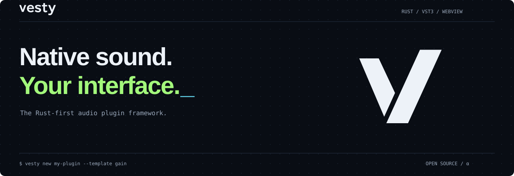

<p align="center">
  
</p>

<p align="center">
  <a href="docs/content/docs/index.md"><strong>English docs</strong></a> ·
  <a href="docs/content/docs/zh/index.md"><strong>简体中文</strong></a> ·
  <a href="docs/content/docs/guides/complete-plugin.md">Build a plugin</a> ·
  <a href="examples/">Examples</a> ·
  <a href="https://github.com/backrunner/vesty/releases">Releases</a>
</p>

# Vesty

A Rust-first framework for VST3 effects and instruments. Keep DSP native, give parameters a stable identity, and build your editor with JavaScript, React, Vue, or Svelte in a directly embedded system WebView.

> **Alpha.** Local framework tests and validation tools are available. Release readiness still requires real DAW, platform WebView, Steinberg validator, signing, and notarization evidence. See the [release evidence guide](docs/content/docs/tooling/release-evidence.md).

## Built for the audio thread

| Native processing | Editor development | From source to plugin |
| --- | --- | --- |
| Borrowed f32/f64 audio buffers | System WebView through `wry` | Embedded starter templates |
| Sample-accurate automation and MIDI | Typed JSBridge and generated TypeScript | VST3 packaging and validation |
| Preallocated event batches and lock-free queues | React, Vue, Svelte, or plain JavaScript | Parameter manifests and release checks |
| Typed parameters and stable VST3 IDs | Host-authoritative state and edit gestures | Reproducible CLI workflows |

The audio callback must not allocate, lock, block, format logs, process JSON, or call WebView APIs. UI and control work live outside that boundary. Vesty embeds `wry` directly, with no Tauri runtime.

## Start building

Use Rust **1.95+**, and Node.js **24+** for Web UI projects. The `wry` backend also needs the platform's WebView development libraries; run `vesty doctor` to inspect your environment.

Install the CLI from GitHub Releases on macOS or Linux:

```bash
curl --proto '=https' --tlsv1.2 -LsSf \
  https://raw.githubusercontent.com/backrunner/vesty/main/scripts/install.sh | sh
vesty --version
vesty doctor
```

Then create a plugin:

```bash
vesty templates
vesty new my-plugin --template gain
cd my-plugin
cargo test
```

<details>
<summary>Windows and prerelease installs</summary>

In PowerShell:

```powershell
irm https://raw.githubusercontent.com/backrunner/vesty/main/scripts/install.ps1 | iex
```

The installers select the latest stable GitHub Release. To install an alpha or beta, set `VESTY_VERSION` to its v-prefixed release tag. See [Get started](docs/content/docs/quick-start.md) for installation details and [CLI tooling](docs/content/docs/tooling/cli.md) for source checkout workflows.

</details>

Follow the [complete plugin tutorial](docs/content/docs/guides/complete-plugin.md) to implement the effect, build a VST3 bundle, and validate it.

## Choose your starting point

| Example | Explore |
| --- | --- |
| [Gain](examples/gain) | An audio effect with typed parameters and automation |
| [MIDI synth](examples/midi-synth) | Notes, expression, SysEx, and sample-accurate event processing |
| [Web UI parameter demo](examples/web-ui-param-demo) | A WebView editor connected to host parameter state |

Dense event blocks use batches of up to 512 events; later events are retained. Kernels must consume zero-frame event contexts too. SysEx still has a separate 256-byte payload limit. The [MIDI guide](docs/content/docs/guides/midi.md) explains timing, note identity, capacity, and CPU tradeoffs.

## Read the docs

The bilingual [Svedocs site](docs/) includes a custom Vesty theme and landing page. Its source is fully included here.

| Learn | Build | Ship |
| --- | --- | --- |
| [Architecture](docs/content/docs/concepts/architecture.md) | [Parameters](docs/content/docs/guides/parameters.md) | [CLI](docs/content/docs/tooling/cli.md) |
| [Realtime safety](docs/content/docs/concepts/realtime-safety.md) | [DSP and MIDI](docs/content/docs/guides/midi.md) | [Packaging](docs/content/docs/tooling/packaging.md) |
| [Plugin API](docs/content/docs/reference/plugin-api.md) | [Web UI](docs/content/docs/guides/web-ui.md) | [Release evidence](docs/content/docs/tooling/release-evidence.md) |

Run the site locally with `cd docs && pnpm install --frozen-lockfile && pnpm dev`. See [site maintenance](docs/README.md) for builds, deployment, and branding.

For AI-assisted development, use the repository's [`vesty-plugin-dev` skill](skills/vesty-plugin-dev/SKILL.md), which preserves realtime boundaries and release-evidence requirements.

## Contribute

The repository is organized into Rust [crates](crates/), the [UI package](packages/), [examples](examples/), and [documentation](docs/). Architecture notes and completion audits live in [.agents](.agents/).

Read [AGENTS.md](AGENTS.md) for development rules. Keep commits focused and use `type(scope): description`, for example `fix(vst3): preserve sample-accurate automation`.

```bash
cargo fmt --all --check
cargo test --workspace --all-features
cargo clippy --workspace --all-targets --all-features -- -D warnings
npm run typecheck
npm test
cargo run -p vesty-cli -- export-types --out target/vesty-protocol --check
```

These checks verify the repository locally. They complement real host and platform testing.

## License

[Apache License 2.0](LICENSE-APACHE).
